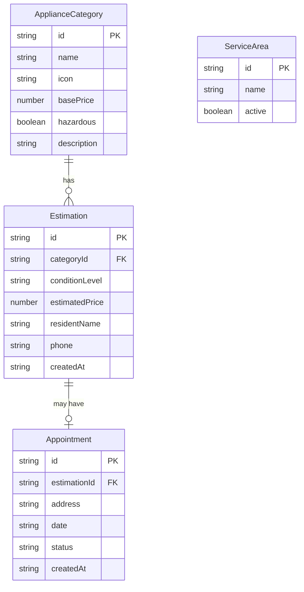

## 1. 架构设计

```mermaid
flowchart TB
    subgraph "前端层"
        "React SPA"
        "Zustand 状态管理"
        "React Router"
    end
    subgraph "数据持久层"
        "localStorage"
        "Zustand Persist Middleware"
    end
    subgraph "业务逻辑层"
        "估价计算引擎"
        "预约校验规则"
        "品类管理逻辑"
    end
    "React SPA" --> "Zustand 状态管理"
    "Zustand 状态管理" --> "Zustand Persist Middleware"
    "Zustand Persist Middleware" --> "localStorage"
    "React SPA" --> "估价计算引擎"
    "React SPA" --> "预约校验规则"
    "React SPA" --> "品类管理逻辑"
```

## 2. 技术说明

- **前端框架**：React@18 + TypeScript + Vite
- **样式方案**：Tailwind CSS@3
- **状态管理**：Zustand（含 persist 中间件实现 localStorage 持久化）
- **路由**：React Router DOM@6
- **图标**：lucide-react
- **后端**：无（纯前端，数据通过 localStorage 持久化）
- **数据库**：localStorage（浏览器本地存储）

## 3. 路由定义

| 路由 | 用途 |
|------|------|
| `/` | 首页 - 角色入口选择 |
| `/resident` | 居民估价页 - 品类选择、成色填写、估价、预约 |
| `/collector` | 回收员工作台 - 估价列表、预约管理 |
| `/admin` | 管理员后台 - 品类管理、回收范围配置 |

## 4. 数据模型

### 4.1 数据模型定义



### 4.2 数据定义

```typescript
interface ApplianceCategory {
  id: string;
  name: string;
  icon: string;
  basePrice: number;
  hazardous: boolean;
  description: string;
}

type ConditionLevel = 'brand_new' | 'ninety_pct' | 'seventy_pct' | 'fifty_pct' | 'unusable';

interface Estimation {
  id: string;
  categoryId: string;
  conditionLevel: ConditionLevel | '';
  estimatedPrice: number | null;
  residentName: string;
  phone: string;
  createdAt: string;
}

type AppointmentStatus = 'pending' | 'confirmed' | 'completed' | 'cancelled';

interface Appointment {
  id: string;
  estimationId: string;
  address: string;
  date: string;
  status: AppointmentStatus;
  createdAt: string;
}

interface ServiceArea {
  id: string;
  name: string;
  active: boolean;
}
```

### 4.3 估价计算规则

| 成色等级 | 乘数 |
|----------|------|
| 全新 (brand_new) | 1.0 |
| 九成新 (ninety_pct) | 0.75 |
| 七成新 (seventy_pct) | 0.5 |
| 五成新 (fifty_pct) | 0.3 |
| 无法使用 (unusable) | 0.1 |

**估价公式**：`estimatedPrice = category.basePrice × conditionMultiplier`
